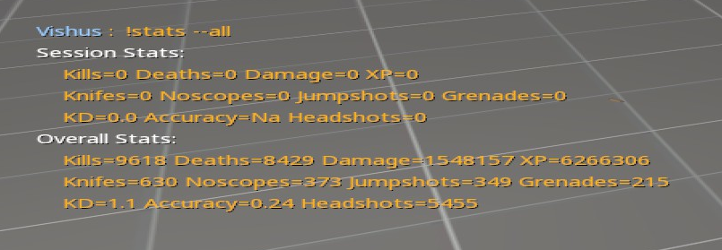

# Pro XP

A flexible stats tracker and xp-based level system for Counter-Strike Source.

Only works for CSS at the moment but shouldn't be hard to make compatible with CSGO (if you are willing to help with this let me know).

## Screenshots



See [screenshots](screenshots.md) for more

## Overview

ProXP was designed to be a slimmer replacement for something like `rankme` while also adding an xp and level system.  In addition to XP it also tracks kills, deaths, damage dealt, knife kills, noscopes (if [ProZoom](https://github.com/vishusandy/ProZoom) is running), jumpshots, grenade kills, KD ratio, accuracy, and headshots.  Stats are tracked both per-session (from join to disconnect) and overall.

This plugin will use clan tags to display the user's level.  For players reaching the level cap (defaults to 100), special tags can be displayed.

## Features

- Per-session and overall stats tracking

- Level rankings

- If [ProZoom](https://github.com/vishusandy/ProZoom) is installed noscopes will give extra xp and track noscopes.

- If [ProSprint](https://github.com/vishusandy/ProSprint) is installed it will give bonus stamina depending on your level.

- A set of natives are provided for querying level/xp information from other plugins.

- Also for users of [Little Anti-Cheat](https://github.com/J-Tanzanite/Little-Anti-Cheat), XP is deducted if the user is caught cheating.  Amounts can be configured in the `include/pro_xp/config.inc` file and requires recompiling.

## Commands

- `!level`: displays your current level progress

- `!rankings` or `!top`: displays the overall rankings based on XP

- `!myrank` or `!rank`: shows where you are ranked overall based on XP

- `!xphelp`: show xp related commands

- Stats
  - `!stats` or `!statistics`: by default shows KD, accuracy, and kills for both current session and overall
    - Syntax: `!stats [--all|--verbose|--extended|--kills]`
  - `!stats help`: shows options for displaying statistics
  - `!stats --all`: shows all statistics
  - `!morestats`: same as `!stats --all`
  - `!session`: displays stats for the current session (uses same options described in `!stats help`)
  - `!overall`: displays overall stats (uses same options described in `!stats help`)

- Console commands
  - `dumpxp`: dumps the all xp stats to a file
  - `listxp`: lists all xp stats in the console

## Installation

Installation is fairly simple: 

1. modify your `databases.cfg` file
   
   ```
     "pro_xp"
       {
           "driver"      "default"
           "host"        "<hostname>"
           "database"    "<database>"
           "user"        "<username>"
           "pass"        "<password>"
       }
   ```

2. then copy the .smx file to the plugins folder (e.g. `cstrike/addons/sourcemod/plugins`)

3. load the plugin (e.g. `sm plugins load filename.smx`)

The table should be created automatically on first run (only tested with MySQL, but should work with Postgres and SQLite).  If you have problems see [Database Setup](db_setup.md).

## Plugin Interface

See [Plugin Interface](interface.md) for information on how to interact with ProXP using other plugins.

## Dependencies

- [morecolors.inc](https://forums.alliedmods.net/showthread.php?t=185016) (included)
- Optional - [ProSprint](https://github.com/vishusandy/ProSprint): gives stamina bonus depending on your level
- Optional - [ProZoom](https://github.com/vishusandy/ProZoom): gives xp bonus for noscope hits

## Todo

- Make a `config.cfg` file to store user configuration
- Add translations
- Add seasonal rankings


## Credits

Shoutout to Fancy for all of the debugging help and testing

